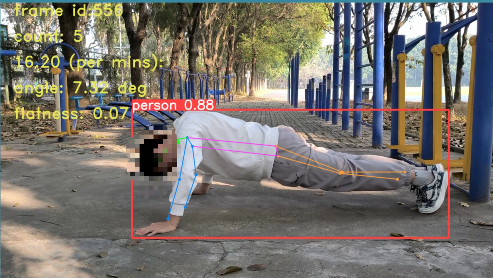

# 运动姿势评估 :white_check_mark:

* 包含高抬腿，仰卧起坐，俯卧撑等类别
* 完成计数，测速，角度检测以及一些简单的指标评估

## Libirary

* 在 **pytorch，opencv，ultralytics** 等库上进行开发

在 **源代码目录下** 依赖安装指令

```bash
	pip install -r requirements.txt
```


## 程序运行选项

- 安装依赖后 **在源代码目录下** 使用诸如指令运行程序

```
	python app.py -m situp -s src/situp.mp4 
```

- 可使用选项

| 选项                  | 解释          | 可选值                  | 是否必选 | 默认值               |
| --------------------- | ------------- | ----------------------- | -------- | -------------------- |
| -m，--mode            | 检测模式      | situp, pushup, highknee | **是**   | 无                   |
| -s, --source          | 检测视频源    | 视频路径                | **是**   | 无                   |
| -d, --detection_model | 使用的模型    | 模型路径                | **否**   | ./models/sports_n.pt |
| -w, --wait_ms         | 帧间隔 (毫秒) | **INT**                 | **否**   | 1                    |





